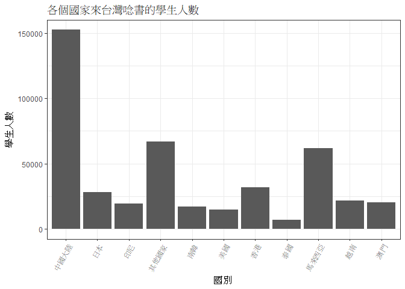
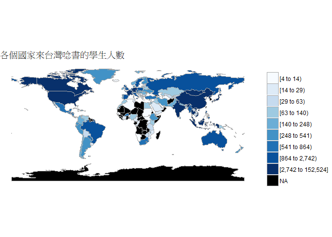
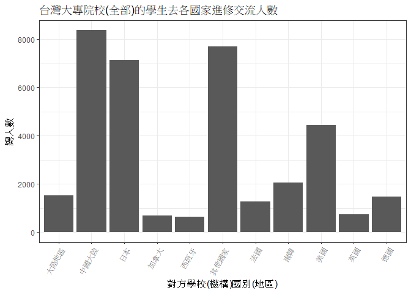
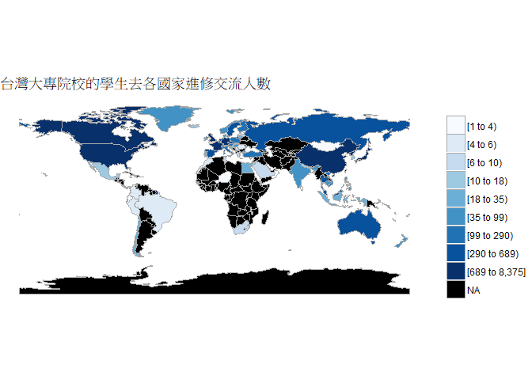
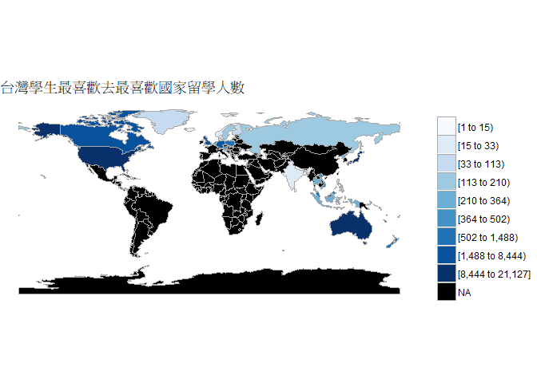
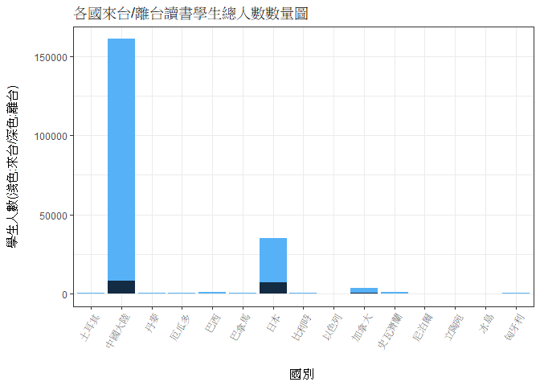
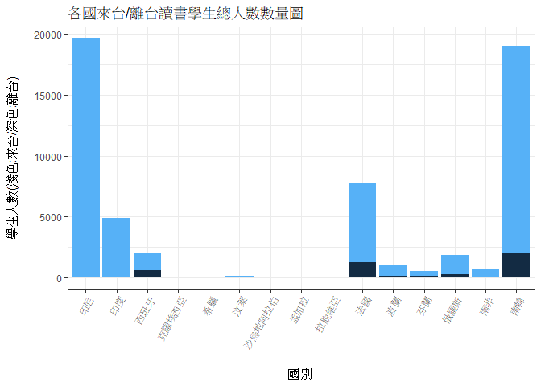
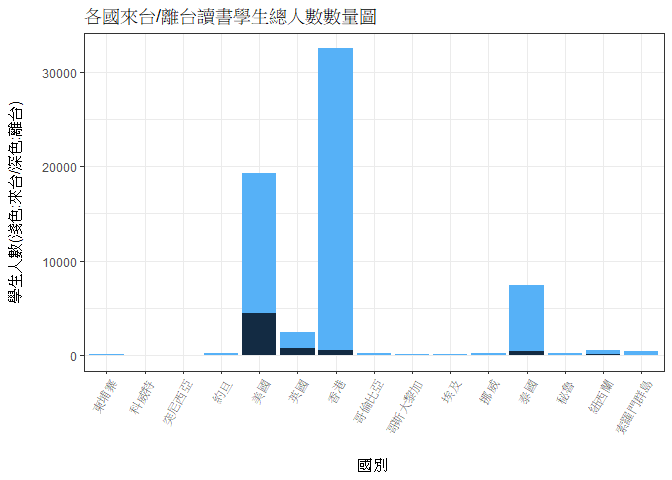
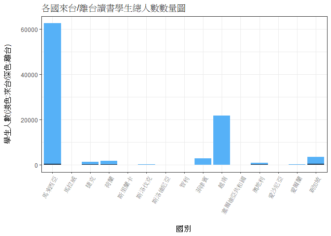
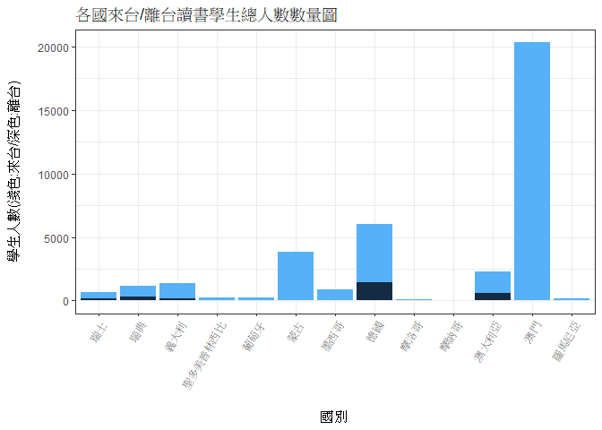

106-2 大數據分析方法 作業二
================
Yu-Ting He

作業完整說明[連結](https://docs.google.com/document/d/1aLGSsGXhgOVgwzSg9JdaNz2qGPQJSoupDAQownkGf_I/edit?usp=sharing)

學習再也不限定在自己出生的國家，台灣每年有許多學生選擇就讀國外的大專院校，同時也有人多國外的學生來台灣就讀，透過分析[大專校院境外學生人數統計](https://data.gov.tw/dataset/6289)、[大專校院本國學生出國進修交流數](https://data.gov.tw/dataset/24730)、[世界各主要國家之我國留學生人數統計表](https://ws.moe.edu.tw/Download.ashx?u=C099358C81D4876CC7586B178A6BD6D5062C39FB76BDE7EC7685C1A3C0846BCDD2B4F4C2FE907C3E7E96F97D24487065577A728C59D4D9A4ECDFF432EA5A114C8B01E4AFECC637696DE4DAECA03BB417&n=4E402A02CE6F0B6C1B3C7E89FDA1FAD0B5DDFA6F3DA74E2DA06AE927F09433CFBC07A1910C169A1845D8EB78BD7D60D7414F74617F2A6B71DC86D17C9DA3781394EF5794EEA7363C&icon=..csv)可以了解103年以後各大專院校國際交流的情形。請同學分析以下議題，並以視覺化的方式呈現分析結果，呈現103年以後大專院校國際交流的情形。

來台境外生分析
--------------

### 資料匯入與處理

``` r
library(readr)
library(dplyr)
#取得104、105、106年度來台唸書學生資料(依國家分類)
data103country <- read_csv("https://quality.data.gov.tw/dq_download_csv.php?nid=6289&md5_url=25f64d5125016dcd6aed42e50c972ed0")
data104country <- read_csv("https://quality.data.gov.tw/dq_download_csv.php?nid=6289&md5_url=4d3e9b37b7b0fd3aa18a388cdbc77996")
data105country <- read_csv("https://quality.data.gov.tw/dq_download_csv.php?nid=6289&md5_url=19bedf88cf46999da12513de755c33c6")
data106country <- read_csv("https://quality.data.gov.tw/dq_download_csv.php?nid=6289&md5_url=50e3370f9f8794f2054c0c82a2ed8c91")

#新增欄位totalStudent103儲存103年度來台唸書學生的加總
data103country$totalStudent103<-0
for(n in 1:length(rownames(data103country))){
  data103country$totalStudent103[n]<-sum(data103country[n,c(-1,-2)])
}
#新增欄位totalStudent104儲存104年度來台唸書學生的加總
data104country$totalStudent104<-0
for(n in 1:length(rownames(data104country))){
  data104country$totalStudent104[n]<-sum(data104country[n,c(-1,-2)])
}
#新增欄位totalStudent105儲存105年度來台唸書學生的加總
data105country$totalStudent105<-0
for(n in 1:length(rownames(data105country))){
  data105country$totalStudent105[n]<-sum(data105country[n,c(-1,-2)])
}
#新增欄位totalStudent106儲存106年度來台唸書學生的加總
data106country$totalStudent106<-0
for(n in 1:length(rownames(data106country))){
  data106country$totalStudent106[n]<-sum(data106country[n,c(-1,-2)])
}
#合併103、104、105、106年度來台唸書學生資料
join103104<-inner_join(data103country,data104country,by="國別")
join105106<-inner_join(data105country,data106country,by="國別")
join103104105106<-inner_join(join103104,join105106,by="國別")
```

### 哪些國家來台灣唸書的學生最多呢？

``` r
#取出學生數量前十名的國家與總人數並由大到小排序
join103104105106<-
  join103104105106%>%
  mutate(totalStudent=totalStudent103+totalStudent104+totalStudent105+totalStudent106)%>%
  select("國別",totalStudent)%>%
  arrange(desc(totalStudent))

knitr::kable(head(join103104105106,10))
```

| 國別     |  totalStudent|
|:---------|-------------:|
| 中國大陸 |        152524|
| 馬來西亞 |         62031|
| 香港     |         31940|
| 日本     |         28200|
| 越南     |         21670|
| 澳門     |         20302|
| 印尼     |         19620|
| 南韓     |         16948|
| 美國     |         14846|
| 泰國     |          7035|

輸出結果為來台灣唸書學生數量前十名的國家與學生總人數。 依序為中國大陸、馬來西亞、香港、日本、越南、澳門、印尼、南韓、美國、泰國。 從輸出總學生數量可以看出，來自**中國大陸**的學生數量遙遙領先，甚至是第二名的馬來西亞學生數量的兩倍之多；來源國家幾乎皆位於亞洲。

### 哪間大學的境外生最多呢？

``` r
#取得104、105、106年度來台唸書學生資料(依學校分類)
data103school <- read_csv("https://quality.data.gov.tw/dq_download_csv.php?nid=6289&md5_url=a6d1469f39fe41fb81dbfc373aef3331")
data104school <- read_csv("https://quality.data.gov.tw/dq_download_csv.php?nid=6289&md5_url=8baeae81cba74f35cf0bb1333d3d99f5")
data105school <- read_csv("https://quality.data.gov.tw/dq_download_csv.php?nid=6289&md5_url=1a485383cf9995da679c3798ab4fd681")
data106school <- read_csv("https://quality.data.gov.tw/dq_download_csv.php?nid=6289&md5_url=883e2ab4d5357f70bea9ac44a47d05cc")
#清洗資料中有雜值的欄位並轉換型態
data103school$`非學位生-大陸研修生`<-gsub("…","0",data103school$`非學位生-大陸研修生`)
data103school$`非學位生-大陸研修生`<-as.numeric(data103school$`非學位生-大陸研修生`)
data104school$`非學位生-大陸研修生`<-gsub("…","0",data104school$`非學位生-大陸研修生`)
data104school$`非學位生-大陸研修生`<-as.numeric(data104school$`非學位生-大陸研修生`)

#新增欄位totalStudent103儲存103年度來台唸書學生的加總
data103school$totalStudent103<-0
for(n in 1:length(rownames(data103school))){
  data103school$totalStudent103[n]<-sum(data103school[n,c(-1,-2,-3)])
}
#新增欄位totalStudent104儲存104年度來台唸書學生的加總
data104school$totalStudent104<-0
for(n in 1:length(rownames(data104school))){
  data104school$totalStudent104[n]<-sum(data104school[n,c(-1,-2,-3)])
}
#新增欄位totalStudent105儲存105年度來台唸書學生的加總
data105school$totalStudent105<-0
for(n in 1:length(rownames(data105school))){
  data105school$totalStudent105[n]<-sum(data105school[n,c(-1,-2,-3)])
}
#新增欄位totalStudent106儲存106年度來台唸書學生的加總
data106school$totalStudent106<-0
for(n in 1:length(rownames(data106school))){
  data106school$totalStudent106[n]<-sum(data106school[n,c(-1,-2,-3)])
}
#合併104、105、106年度來台唸書學生資料
join103104<-inner_join(data103school,data104school,by="學校名稱")
join105106<-inner_join(data105school,data106school,by="學校名稱")
join103104105106_2<-inner_join(join103104,join105106,by="學校名稱")

#取出學生數量前十名的學校與總人數並由大到小排序
join103104105106_2<-
  join103104105106_2%>%
  mutate(totalStudent=totalStudent103+totalStudent104+totalStudent105+totalStudent106)%>%
  select("學校名稱",totalStudent)%>%
  arrange(desc(totalStudent))

knitr::kable(head(join103104105106_2,10))
```

| 學校名稱         |  totalStudent|
|:-----------------|-------------:|
| 國立臺灣師範大學 |         22113|
| 國立臺灣大學     |         18199|
| 中國文化大學     |         16074|
| 銘傳大學         |         16057|
| 淡江大學         |         13887|
| 國立政治大學     |         11626|
| 國立成功大學     |         10982|
| 輔仁大學         |          9499|
| 逢甲大學         |          9474|
| 中原大學         |          7662|

輸出結果為境外生最多前十名的大學學校名稱與學生總人數。 依序為國立臺灣師範大學、國立臺灣大學、中國文化大學、銘傳大學、淡江大學、國立政治大學、國立成功大學、輔仁大學、逢甲大學、中原大學。 若以台灣北中南地區判斷，**境外生最多的學校大多數位於台灣北部**(國立臺灣師範大學、國立臺灣大學、中國文化大學、銘傳大學、淡江大學、國立政治大學、輔仁大學)；**學校是否為國立不是影響境外生選擇的主因**(國立:4間；私立：6間)

### 各個國家來台灣唸書的學生人數條狀圖

``` r
library(ggplot2)
#加總學生數量前十名以外的總人數，歸類為"其他國家"
other<-data.frame("國別"="其他國家",totalStudent=sum(join103104105106[-(1:10),2]),stringsAsFactors=F)
#將其他國家分類加入只有前十名國家的data.frame
join103104105106_bar<-
  join103104105106%>%
  head(10)%>%
  rbind(other)
#製作bar chart
ggplot(join103104105106_bar,aes(x=`國別`,y=totalStudent))+
  geom_bar(stat="identity")+
  labs(x="國別",y="學生人數",title="各個國家來台灣唸書的學生人數")+
  theme_bw()+
  theme(axis.text.x = element_text(angle = 60, hjust = 1))
```



由條狀圖可以明顯看出**中國大陸**的學生數量占來台念書學生人數大宗。

### 各個國家來台灣唸書的學生人數面量圖

``` r
library(ggmap)
library(choroplethr)
library(choroplethrMaps)
library(readr)
library(dplyr)
comparision <- read_csv("C:/Users/He Yu-Ting/Desktop/CountriesComparisionTable.csv")

resourse<-inner_join(join103104105106,comparision,by=c("國別"="Taiwan"))
str(resourse)
```

    ## Classes 'tbl_df', 'tbl' and 'data.frame':    137 obs. of  4 variables:
    ##  $ 國別        : chr  "中國大陸" "馬來西亞" "香港" "日本" ...
    ##  $ totalStudent: num  152524 62031 31940 28200 21670 ...
    ##  $ ISO3        : chr  "CHN" "MYS" "HKG" "JPN" ...
    ##  $ English     : chr  "china" "malaysia" "Unmatch" "japan" ...

``` r
resourse<-
  resourse[c(-135,-136),]%>%
  filter(English!="Unmatch")
result<-data.frame("region"=resourse$English,"value"=resourse$totalStudent,stringsAsFactors = F)
country_choropleth(result,title ="各個國家來台灣唸書的學生人數",num_colors = 9)
```

    ## Warning in super$initialize(country.map, user.df): Your data.frame contains
    ## the following regions which are not mappable: Singapore

    ## Warning in self$bind(): The following regions were missing and are being
    ## set to NA: afghanistan, angola, moldova, madagascar, mali, montenegro,
    ## mauritania, burundi, niger, oman, qatar, western sahara, sierra leone,
    ## somaliland, somalia, suriname, chad, togo, east timor, trinidad and tobago,
    ## taiwan, the bahamas, vanuatu, zambia, albania, botswana, central african
    ## republic, democratic republic of the congo, northern cyprus, cyprus,
    ## djibouti, eritrea, gabon, georgia, ghana, antarctica, guinea, guinea
    ## bissau, equatorial guinea, guyana, jamaica, south korea, kosovo, lebanon,
    ## liberia, libya, lesotho



由面量圖可以看出，**世界各國來台唸書學生來源比較集中**，有許多地區沒有學生來台念書。

台灣學生國際交流分析
--------------------

### 資料匯入與處理

``` r
library(readr)
library(dplyr)
abroad_school<- read_csv("C:/Users/He Yu-Ting/Desktop/Student.csv")
```

### 台灣大專院校的學生最喜歡去哪些國家進修交流呢？

``` r
abroad_result1<-
  abroad_school%>%
  filter(學年度 %in% c("103","104"))%>%
  select(`對方學校(機構)國別(地區)`,"小計")%>%
  group_by(`對方學校(機構)國別(地區)`)%>%
  summarise(總人數=sum(小計))%>%
  arrange(desc(總人數))

knitr::kable(head(abroad_result1,10))
```

| 對方學校(機構)國別(地區) | 總人數 |
|:-------------------------|:------:|
| 中國大陸                 |  8375  |
| 日本                     |  7142  |
| 美國                     |  4427  |
| 南韓                     |  2050  |
| 大陸地區                 |  1516  |
| 德國                     |  1466  |
| 法國                     |  1258  |
| 英國                     |   742  |
| 加拿大                   |   689  |
| 西班牙                   |   642  |

輸出結果為台灣大專院校學生最喜歡去哪些國家進修交流前十名，列出前十名的對方學校(機構)國別(地區)名稱與學生總人數。 依序為中國大陸、日本、美國、南韓、大陸地區、德國、法國、英國、加拿大、西班牙。 從結果可以發現台灣學生出國進修交流的第一、二名為中國大陸及日本，推測是與我國**地緣關係及教育資源豐富**進而吸引學生前往；也可以發現台灣學生**喜歡前往歐洲大國(德國、法國、英國、西班牙)、美洲(美國、加拿大)進修交流**。

### 哪間大學的出國交流學生數最多呢？

``` r
abroad_result2<-
  abroad_school%>%
  filter(學年度 %in% c("103","104"))%>%
  select("學校名稱","小計")%>%
  group_by(學校名稱)%>%
  summarise(總人數=sum(小計))%>%
  arrange(desc(總人數))

knitr::kable(head(abroad_result2,10))
```

| 學校名稱     | 總人數 |
|:-------------|:------:|
| 國立臺灣大學 |  2224  |
| 淡江大學     |  2038  |
| 國立政治大學 |  1876  |
| 逢甲大學     |  1346  |
| 元智大學     |  1106  |
| 國立臺北大學 |   956  |
| 國立交通大學 |   951  |
| 東海大學     |   931  |
| 東吳大學     |   873  |
| 國立成功大學 |   846  |

輸出結果為前十名出國交流學生數最多的大學，欄位為學校名稱與學生總人數。 依序為國立臺灣大學、淡江大學、國立政治大學、逢甲大學、元智大學、國立臺北大學、國立交通大學、東海大學、東吳大學、國立成功大學。 從結果可以看出，教育資源最豐富的**臺灣大學**出國交流學生數也最多，依序下來可以發現**出國交流的學生不分學校是否為公私立皆有機會**。

### 台灣大專院校的學生最喜歡去哪些國家進修交流條狀圖

``` r
#加總學生數量前十名以外的總人數，歸類為"其他國家"
other<-data.frame("對方學校(機構)國別(地區)"="其他國家","總人數"=sum(abroad_result1[-(1:10),2]),stringsAsFactors=F)
other$`對方學校(機構)國別(地區)`<-other$對方學校.機構.國別.地區.
other<-
  other%>%
  select("對方學校(機構)國別(地區)","總人數")
#將其他國家分類加入只有前十名國家的data.frame
abroad_result_bar<-
  abroad_result1%>%
  head(10)%>%
  rbind(other)
#製作bar chart
ggplot(abroad_result_bar,aes(x=`對方學校(機構)國別(地區)`,y=`總人數`))+
  geom_bar(stat="identity")+
  labs(x="對方學校(機構)國別(地區)",y="總人數",title="台灣大專院校(全部)的學生去各國家進修交流人數")+
  theme_bw()+
  theme(axis.text.x = element_text(angle = 60, hjust = 1))
```



由條狀圖可以明顯看出**中國大陸、日本**的學生數量占離台念書學生人數大宗，除了前十名外，也有許多學生前往不同國家進行交流。

### 台灣大專院校的學生最喜歡去哪些國家進修交流面量圖

``` r
library(ggmap)
library(choroplethr)
library(choroplethrMaps)
library(readr)
library(dplyr)
comparision <- read_csv("C:/Users/He Yu-Ting/Desktop/CountriesComparisionTable.csv")

resourse<-inner_join(abroad_result1,comparision,by=c(`對方學校(機構)國別(地區)`="Taiwan"))
str(resourse)
```

    ## Classes 'tbl_df', 'tbl' and 'data.frame':    79 obs. of  4 variables:
    ##  $ 對方學校(機構)國別(地區): chr  "中國大陸" "日本" "美國" "南韓" ...
    ##  $ 總人數                  : int  8375 7142 4427 2050 1466 1258 742 689 642 572 ...
    ##  $ ISO3                    : chr  "CHN" "JPN" "USA" "KOR" ...
    ##  $ English                 : chr  "china" "japan" "united states of america" "north korea" ...

``` r
resourse<-
  resourse[c(-46),]%>%
  filter(English!="Unmatch")
result<-data.frame("region"=resourse$English,"value"=resourse$總人數,stringsAsFactors = F)
country_choropleth(result,title ="台灣大專院校的學生去各國家進修交流人數",num_colors = 9)
```

    ## Warning in super$initialize(country.map, user.df): Your data.frame contains
    ## the following regions which are not mappable: Singapore

    ## Warning in self$bind(): The following regions were missing and are being
    ## set to NA: afghanistan, angola, azerbaijan, moldova, madagascar, macedonia,
    ## mali, myanmar, montenegro, mozambique, mauritania, burundi, namibia,
    ## nigeria, nicaragua, pakistan, papua new guinea, benin, paraguay, rwanda,
    ## western sahara, sudan, burkina faso, south sudan, senegal, sierra leone,
    ## el salvador, somaliland, somalia, suriname, syria, chad, togo, tajikistan,
    ## turkmenistan, east timor, bulgaria, trinidad and tobago, taiwan, united
    ## republic of tanzania, uganda, ukraine, uruguay, uzbekistan, the bahamas,
    ## venezuela, vanuatu, yemen, zambia, zimbabwe, bosnia and herzegovina,
    ## belarus, albania, belize, bolivia, bhutan, botswana, central african
    ## republic, united arab emirates, ivory coast, cameroon, democratic republic
    ## of the congo, republic of congo, cuba, northern cyprus, cyprus, argentina,
    ## djibouti, dominican republic, algeria, eritrea, armenia, ethiopia,
    ## fiji, gabon, georgia, ghana, antarctica, guinea, gambia, guinea bissau,
    ## equatorial guinea, guatemala, guyana, honduras, haiti, iran, iraq, jamaica,
    ## kazakhstan, kenya, kyrgyzstan, kosovo, laos, lebanon, liberia, libya,
    ## lesotho, luxembourg



由面量圖可以看出，離台念書學生選擇又比來台唸書學生選擇更加集中，有許多地區沒有學生來台念書，非洲、南美洲幾乎沒有台灣學生。

台灣學生出國留學分析
--------------------

### 資料匯入與處理

``` r
library(readr)
library(dplyr)
abroad_world<- read_csv("https://ws.moe.edu.tw/Download.ashx?u=C099358C81D4876CC7586B178A6BD6D5062C39FB76BDE7EC7685C1A3C0846BCDD2B4F4C2FE907C3E7E96F97D24487065577A728C59D4D9A4ECDFF432EA5A114C8B01E4AFECC637696DE4DAECA03BB417&n=4E402A02CE6F0B6C1B3C7E89FDA1FAD0B5DDFA6F3DA74E2DA06AE927F09433CFBC07A1910C169A1845D8EB78BD7D60D7414F74617F2A6B71DC86D17C9DA3781394EF5794EEA7363C&icon=..csv")
```

### 台灣學生最喜歡去哪些國家留學呢？

``` r
abroad_world<-
  abroad_world%>%
  select("國別","總人數")%>%
  arrange(desc(總人數))

knitr::kable(head(abroad_world,10))
```

| 國別     | 總人數 |
|:---------|:------:|
| 美國     |  21127 |
| 澳大利亞 |  13582 |
| 日本     |  8444  |
| 加拿大   |  4827  |
| 英國     |  3815  |
| 德國     |  1488  |
| 紐西蘭   |  1106  |
| 波蘭     |   561  |
| 馬來西亞 |   502  |
| 奧地利   |   419  |

輸出結果為台灣學生最喜歡去哪些國家留學前十名，欄位為國別與學生總人數。 依序為美國、澳大利亞、日本、加拿大、英國、德國、紐西蘭、波蘭、馬來西亞、奧地利。 與上面「台灣大專院校學生最喜歡去哪些國家進修交流前十名」相比，台灣學生選擇的國家進修交流第一名**中國大陸沒出現在台灣學生最想要去的國家前十名內**；相較之下**增加了澳大利亞、紐西蘭、波蘭、馬來西亞、奧地利這些沒有出現在台灣學生出國交流的選擇**，看來台灣學生想的跟實際上去交流的國家有出入，挺有趣的。

### 台灣學生最喜歡去哪些國家留學面量圖

``` r
library(ggmap)
library(choroplethr)
library(choroplethrMaps)
library(readr)
library(dplyr)
comparision <- read_csv("C:/Users/He Yu-Ting/Desktop/CountriesComparisionTable.csv")

resourse<-inner_join(abroad_world,comparision,by=c("國別"="Taiwan"))
str(resourse)
```

    ## Classes 'tbl_df', 'tbl' and 'data.frame':    29 obs. of  4 variables:
    ##  $ 國別   : chr  "美國" "澳大利亞" "日本" "加拿大" ...
    ##  $ 總人數 : num  21127 13582 8444 4827 3815 ...
    ##  $ ISO3   : chr  "USA" "AUS" "JPN" "CAN" ...
    ##  $ English: chr  "united states of america" "australia" "japan" "canada" ...

``` r
resourse<-
  resourse[c(-46),]%>%
  filter(English!="Unmatch")
result<-data.frame("region"=resourse$English,"value"=resourse$總人數,stringsAsFactors = F)
country_choropleth(result,title ="台灣學生最喜歡去最喜歡國家留學人數",num_colors = 9)
```

    ## Warning in super$initialize(country.map, user.df): Your data.frame contains
    ## the following regions which are not mappable: Singapore

    ## Warning in self$bind(): The following regions were missing and are being
    ## set to NA: afghanistan, angola, azerbaijan, moldova, madagascar, mexico,
    ## macedonia, mali, myanmar, montenegro, mongolia, mozambique, mauritania,
    ## burundi, malawi, namibia, france, niger, nigeria, nicaragua, oman,
    ## pakistan, panama, peru, papua new guinea, benin, portugal, paraguay,
    ## israel, qatar, romania, rwanda, western sahara, saudi arabia, sudan,
    ## burkina faso, south sudan, senegal, solomon islands, sierra leone, el
    ## salvador, somaliland, somalia, republic of serbia, suriname, slovakia,
    ## slovenia, swaziland, syria, chad, togo, tajikistan, turkmenistan, east
    ## timor, bulgaria, trinidad and tobago, tunisia, turkey, taiwan, united
    ## republic of tanzania, uganda, ukraine, uruguay, uzbekistan, the bahamas,
    ## venezuela, vanuatu, yemen, south africa, zambia, zimbabwe, bosnia and
    ## herzegovina, belarus, albania, belize, bolivia, brazil, bhutan, botswana,
    ## central african republic, switzerland, chile, united arab emirates, china,
    ## ivory coast, cameroon, democratic republic of the congo, republic of
    ## congo, colombia, costa rica, cuba, northern cyprus, cyprus, argentina,
    ## czech republic, djibouti, dominican republic, algeria, ecuador, egypt,
    ## eritrea, spain, armenia, estonia, ethiopia, fiji, gabon, georgia, ghana,
    ## antarctica, guinea, gambia, guinea bissau, equatorial guinea, greece,
    ## guatemala, guyana, honduras, croatia, haiti, hungary, ireland, iran, iraq,
    ## italy, jamaica, jordan, kazakhstan, kenya, kyrgyzstan, cambodia, south
    ## korea, kosovo, kuwait, laos, lebanon, liberia, libya, lesotho, lithuania,
    ## luxembourg, latvia, morocco



由面量圖可以明顯看出，台灣學生最喜歡前往的國家集中在**北美洲、歐洲、澳洲**，其餘地區鮮少考慮。

綜合分析
--------

請問來台讀書與離台讀書的來源國與留學國趨勢是否相同(5分)？想來台灣唸書的境外生，他們的母國也有很多台籍生嗎？請圖文並茂說明你的觀察(10分)。

``` r
library(dplyr)
library(tidyr)
library(reshape2)

finaldata<-inner_join(join103104105106,abroad_result1,
                      by=c("國別"="對方學校(機構)國別(地區)"))
finaldata$out<-as.numeric(finaldata$總人數) 
finaldata$come<-finaldata$totalStudent
finaldata<-
  finaldata%>%
  select("國別",out,come)

tx1 <- gather(finaldata, key = key, value= value,out,come)
tx1$row<-ifelse(tx1$key=="out",1,2)
tx1<-tx1%>%arrange(國別)
ggplot(tx1[1:30,], aes(x=國別, y=value, fill=row)) + 
  geom_bar(stat="identity")+
  xlab("\n國別")+
  ylab("學生人數(淺色:來台/深色:離台)\n") +
  labs(title="各國來台/離台讀書學生總人數數量圖")+
  guides(fill=FALSE)+
  theme_bw()+
  theme(axis.text.x = element_text(angle = 60, hjust = 1))
```



``` r
ggplot(tx1[31:60,], aes(x=國別, y=value, fill=row)) + 
  geom_bar(stat="identity") +
  xlab("\n國別")+
  ylab("學生人數(淺色:來台/深色:離台)\n") +
  labs(title="各國來台/離台讀書學生總人數數量圖")+
  guides(fill=FALSE)+
  theme_bw()+
  theme(axis.text.x = element_text(angle = 60, hjust = 1))
```



``` r
ggplot(tx1[61:90,], aes(x=國別, y=value, fill=row)) + 
  geom_bar(stat="identity") +
  xlab("\n國別")+
  ylab("學生人數(淺色:來台/深色:離台)\n") +
  labs(title="各國來台/離台讀書學生總人數數量圖")+
  guides(fill=FALSE)+
  theme_bw()+
  theme(axis.text.x = element_text(angle = 60, hjust = 1))
```



``` r
ggplot(tx1[91:120,], aes(x=國別, y=value, fill=row)) + 
  geom_bar(stat="identity") +
  xlab("\n國別")+
  ylab("學生人數(淺色:來台/深色:離台)\n") +
  labs(title="各國來台/離台讀書學生總人數數量圖")+
  guides(fill=FALSE)+
  theme_bw()+
  theme(axis.text.x = element_text(angle = 60, hjust = 1))
```



``` r
ggplot(tx1[121:length(rownames(tx1)),], aes(x=國別, y=value, fill=row)) + 
  geom_bar(stat="identity") +
  xlab("\n國別")+
  ylab("學生人數(淺色:來台/深色:離台)\n") +
  labs(title="各國來台/離台讀書學生總人數數量圖")+
  guides(fill=FALSE)+
  theme_bw()+
  theme(axis.text.x = element_text(angle = 60, hjust = 1))
```



來台讀書資料表：join103104105106(139筆)；離台讀書資料表：abroad\_result1(116筆)，兩者對照後有73筆國家相符，**有5成~6成的國家是與我國學生互相進修交流**。

上方輸出條狀圖為各國來台/離台學生人數加總數量圖，可以看出**幾乎有明顯來台學生數量的國家，也會有明顯離台學生數量**，除了少數台灣學生比較少考慮的交換國家，
